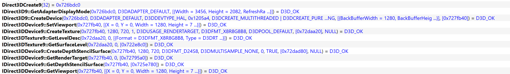
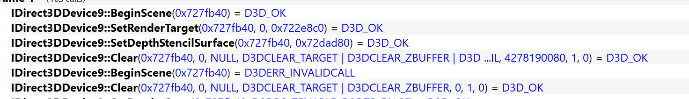
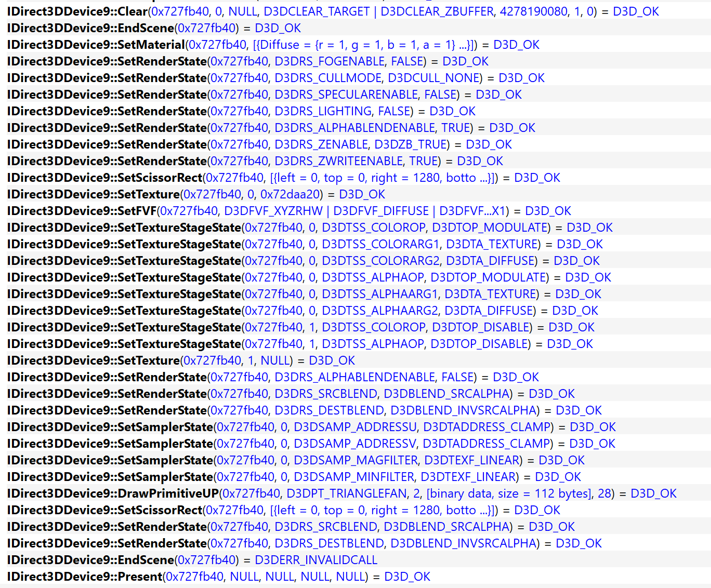
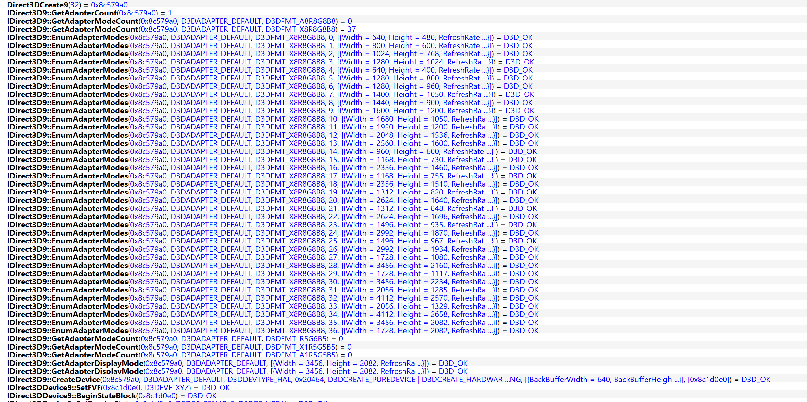
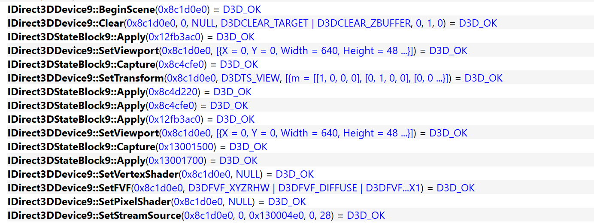
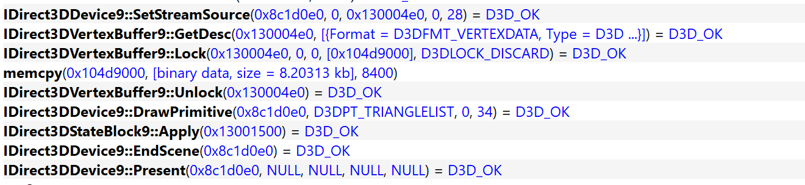

# IIDX 24 GFX upscaling notes

Date: 2023-04-15
Author: icex2

Notes about my work on fixing the upscaling/downscaling feature of bemanitools for IIDX 20 to 26.
I realized that the render backend changed significantly that the old method that worked fine
doesn't work anymore.

The tool used in the screenshots is [apitrace](https://github.com/apitrace/apitrace).

## IIDX 24

The GFX engine in IIDX from 20 to 26 has a changed render loop that includes built-in scaling to
implement the SD and HD/HD* screen settings that are selectable in the operator menu

### Frame 0 - GFX init part

Setting up the context and device, as well as the frame buffer. This also creates the intermediate
texture that is configured as the render target once it begins drawing the scene.

### Frame 1 - A clean main render path

Start the scene and set the render target to the intermediate texture.

After done drawing the scene, the intermediate texture is blended to the framebuffer. With a target
2D plane having the size of the target resolution, the blending applies linear scaling to either
up- or downscale the final image.

## IIDX 10

A recap of the old stuff, see also [my previous notes](2019-10-07-iidx-gfx-rendering-loops.md),
as I had to look at everything again to properly understand the differences.

### Frame 0 - GFX init part

Setting up the context and device, as well as the frame buffer. Renders directly to the frame
buffer.

### Frame 1 - A clean main render path

Beginning the scene excerpt. The viewport needs to match the target resolution to display the
final image correctly.

Ending the scene excerpt, nothing fancy here, just swapping the back buffer.

